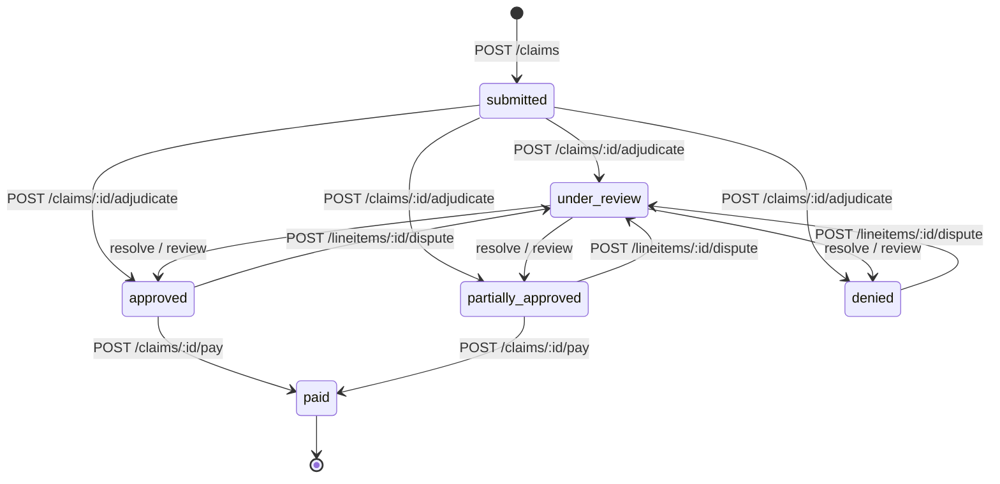

# API Design

> REST contract for the Claims Processing System. The HTTP layer is thin: handlers
> validate input, call the orchestration service, and serialize the result. All domain
> behavior is specified in `domain-model.md`; this doc is the wire format and the
> endpoint↔lifecycle mapping.

## Conventions

| Aspect | Choice |
|---|---|
| Base path | `/v1` |
| Format | JSON request/response; `Content-Type: application/json` |
| Money | **integer cents** in every payload (`payableCents`, never `4.00`) |
| IDs | opaque UUID strings in paths and bodies |
| Auth | **none** (out of scope). A reviewer/actor is passed as a plain label where relevant |
| Time | ISO-8601 (`serviceDate` is a date; timestamps are date-times, UTC) |
| Errors | a single envelope shape (below) |
| Idempotency | not implemented; resubmitting a claim creates a new claim. Duplicate *line* detection is a domain rule, not a transport concern |

### Error envelope

Transport/validation failures (4xx/5xx) return:

```json
{
  "error": {
    "code": "VALIDATION_FAILED",
    "message": "lineItems must contain at least one item",
    "details": [{ "path": "lineItems", "issue": "min 1" }]
  }
}
```

> **Validation failure ≠ denial.** A *malformed* request (missing fields, no line items,
> bad types) is a `422` and **no claim is created**. A *well-formed but domain-invalid*
> line (unknown service type, coverage inactive, duplicate) **creates the claim** and is
> adjudicated to `denied` with a reason code — that's a domain outcome, not a transport
> error. The two are deliberately different mechanisms (decisions.md §4).

### Status codes used

| Code | When |
|---|---|
| `200` | successful read or state transition |
| `201` | claim created (`POST /claims`) |
| `400` | malformed JSON / wrong types |
| `404` | unknown id |
| `409` | illegal state transition (e.g. paying an unadjudicated claim, disputing a `paid` line) |
| `422` | semantic validation failure (well-formed JSON, invalid content) |

## Lifecycle ↔ endpoint map



> `resolve` = `POST /disputes/:id/resolve`; `review` = `POST /lineitems/:id/review`
> (pended lines). Every post-transition status is **re-derived** from the line items,
> never set by the endpoint.

Claim status is always **derived** from its line items (domain-model.md §4); no endpoint
sets it directly.

---

## Endpoints

### 1. Submit a claim — `POST /v1/claims`
Persists the claim and its lines as `submitted`. Does **not** adjudicate (two-step).

> **No `policyId` in the body — by design.** Which enrollment applies is *derived* from
> each line's `serviceDate` (the policy whose window contains it), not asserted by the
> submitter; a claimant can't pick their coverage. Lines that straddle a renewal resolve
> to different policies. See decisions.md ("Coverage is resolved per line, by date of service").

**Request**
```json
{
  "memberId": "mem_001",
  "providerId": "prov_001",
  "lineItems": [
    { "serviceType": "PT", "serviceDate": "2026-03-01", "diagnosisCode": "M54.5", "billedAmountCents": 60000 },
    { "serviceType": "OFFICE_VISIT", "serviceDate": "2026-03-01", "diagnosisCode": "M54.5", "billedAmountCents": 20000 }
  ]
}
```

**Response `201`**
```json
{
  "id": "clm_a1b2",
  "status": "submitted",
  "memberId": "mem_001",
  "providerId": "prov_001",
  "lineItems": [
    { "id": "li_1", "serviceType": "PT", "status": "submitted", "billedAmountCents": 60000 },
    { "id": "li_2", "serviceType": "OFFICE_VISIT", "status": "submitted", "billedAmountCents": 20000 }
  ],
  "submittedAt": "2026-03-05T10:00:00Z"
}
```
`422` if `lineItems` is empty or a line is missing required fields.

---

### 2. Adjudicate a claim — `POST /v1/claims/:id/adjudicate`
Runs the engine over every line in one transaction (locks the member/policy row, sums
the ledger, folds across lines, writes one `AccumulatorEntry` per finalized line). Idempotent
re-adjudication is **not** assumed — calling it on an already-adjudicated claim returns `409`.

**Response `200`** (the PT line partially approved by an annual limit; office visit approved)
```json
{
  "id": "clm_a1b2",
  "status": "partially_approved",
  "lineItems": [
    {
      "id": "li_1",
      "serviceType": "PT",
      "status": "partially_approved",
      "adjudication": {
        "allowedCents": 50000,
        "deductibleAppliedCents": 10000,
        "memberCostShareCents": 8000,
        "payableCents": 20000,
        "memberResponsibilityCents": 30000,
        "reasons": [
          { "code": "ALLOWED_REDUCED", "message": "Billed 60000¢ reduced to allowed rate 50000¢", "amountCents": 10000 },
          { "code": "DEDUCTIBLE_APPLIED", "message": "10000¢ applied to the remaining annual deductible", "amountCents": 10000 },
          { "code": "COINSURANCE_APPLIED", "message": "20% member coinsurance on 40000¢", "amountCents": 8000 },
          { "code": "PARTIALLY_PAID", "message": "Paid 20000¢ up to the remaining annual limit", "amountCents": 20000 },
          { "code": "LIMIT_EXHAUSTED", "message": "12000¢ exceeds the remaining annual limit and is not covered", "amountCents": 12000 }
        ]
      }
    },
    {
      "id": "li_2",
      "serviceType": "OFFICE_VISIT",
      "status": "approved",
      "adjudication": {
        "allowedCents": 20000,
        "deductibleAppliedCents": 0,
        "memberCostShareCents": 3000,
        "payableCents": 17000,
        "memberResponsibilityCents": 3000,
        "reasons": [
          { "code": "COPAY_APPLIED", "message": "3000¢ member copay", "amountCents": 3000 },
          { "code": "COVERED", "message": "Covered service" }
        ]
      }
    }
  ]
}
```
A line whose rule has `requiresManualReview` comes back `pended`, forcing claim
`under_review`. `payable + memberResponsibility === allowed` holds for every covered line.

---

### 3. Get a claim — `GET /v1/claims/:id`
Full claim with per-line adjudication, explanations, and the event timeline.

**Response `200`** (adds, alongside the lines above)
```json
{
  "id": "clm_a1b2",
  "status": "partially_approved",
  "lineItems": [ "...as in adjudicate..." ],
  "events": [
    { "type": "SUBMITTED", "actor": "member", "createdAt": "2026-03-05T10:00:00Z" },
    { "type": "ADJUDICATED", "actor": "system", "createdAt": "2026-03-05T10:00:03Z" }
  ]
}
```
`404` if unknown.

### 4. List a member's claims — `GET /v1/claims?memberId=mem_001`
Returns a summary array (`id`, `status`, `submittedAt`, line count, total payable).

---

### 5. Pay a claim — `POST /v1/claims/:id/pay`
Finalizes an `approved` / `partially_approved` claim. Moves non-denied lines to `paid`,
records `paidAmountCents` (Σ payable of paid lines) and `paidAt`, appends a `PAID` event.

**Response `200`**
```json
{ "id": "clm_a1b2", "status": "paid", "paidAmountCents": 37000, "paidAt": "2026-03-06T09:00:00Z" }
```
`409` if the claim is not in a payable state (e.g. still `under_review` or all `denied`).
Once `paid`, lines are terminal and **not disputable**.

---

### 6. Dispute a line — `POST /v1/lineitems/:id/dispute`
Opens a dispute on a resolved-but-not-paid line (`approved` / `partially_approved` /
`denied`). Line → `disputed`; claim re-derives to `under_review`.

**Request**
```json
{ "reason": "Pre-authorization was obtained by phone before the visit." }
```
**Response `201`**
```json
{ "id": "dsp_1", "lineItemId": "li_1", "status": "open", "reason": "Pre-authorization was obtained by phone before the visit." }
```
`409` if the line is `paid` or `pended` (a pended line uses the review endpoint, not dispute).

### 7. Get a dispute — `GET /v1/disputes/:id`
Returns dispute status (`open` / `resolved`), the resolution, any overrides applied, and the note.

### 8. Resolve a dispute — `POST /v1/disputes/:id/resolve`
One reconciliation path (domain-model.md §6): void the line's prior `AccumulatorEntry`,
re-run the engine with the overrides, write a fresh entry, re-derive claim status, append
a `RESOLVED` event. The service is keyed on the **dispute id** (`:id`) — the handler passes
it straight through with no dispute→line lookup. The `open` guard is re-checked inside the
locking transaction, so a second concurrent resolve returns `409` (decisions.md §5).

**Request — overturn with overrides**
```json
{
  "action": "overturn",
  "overrides": [{ "type": "WAIVE_LIMIT" }, { "type": "WAIVE_DEDUCTIBLE" }],
  "note": "Limit waived per appeal; deductible waived as goodwill."
}
```
**Request — uphold** (trivial: close, no re-run, no ledger change)
```json
{ "action": "uphold", "note": "Original denial stands; service is excluded." }
```
**Response `200`** — the re-adjudicated line (same `adjudication` shape as endpoint 2) plus
the new claim status. `422` if two `OVERRIDE_ALLOWED_AMOUNT` directives conflict.

---

### 9. Resolve a pended line — `POST /v1/lineitems/:id/review`
Reviewer disposition of a `pended` line. `approve` re-runs the engine with
`skipManualReview` and writes a ledger entry; `deny` finalizes with a reason and writes none.

**Request**
```json
{ "action": "approve", "note": "Surgery medically necessary; records attached." }
```
**Response `200`** — the resolved line + re-derived claim status. `409` if the line is not `pended`.

---

### 10. Member accumulators — `GET /v1/members/:id/accumulators`
Showcases the "track usage against limits" signal — usage is summed live from the ledger.
Accepts `?planYear=` (defaults to the current calendar year). `deductibleMetCents` /
`benefitUsedByServiceType` are scoped to that year; `deductibleAnnualCents` and
`limitsByServiceType` are the plan's current configured figures (plan-level, not
year-historical — the plan keeps no per-year design history in this scope).

**Response `200`**
```json
{
  "memberId": "mem_001",
  "planYear": 2026,
  "deductibleAnnualCents": 100000,
  "deductibleMetCents": 100000,
  "benefitUsedByServiceType": { "PT": 200000 },
  "limitsByServiceType": { "PT": 200000 }
}
```

---

## PHI note

Member name / DOB and `diagnosisCode` are PHI. They are accepted on submit and stored,
but the **adjudication engine never receives them** (domain-model.md §5), so they never
appear in `reasons[]` or in adjudication logs. A production system would gate the
PHI-bearing read endpoints behind auth + an access audit (the `Event` log is the seam for
the change-audit half); auth itself is out of scope.

## Not in the API (named cuts)

Registration/login, plan/member/provider management, notifications, reporting, and
post-payment clawback have no endpoints — all are out of scope per the prompt and
`decisions.md`. Reference data is loaded via the seed script, not the API.
