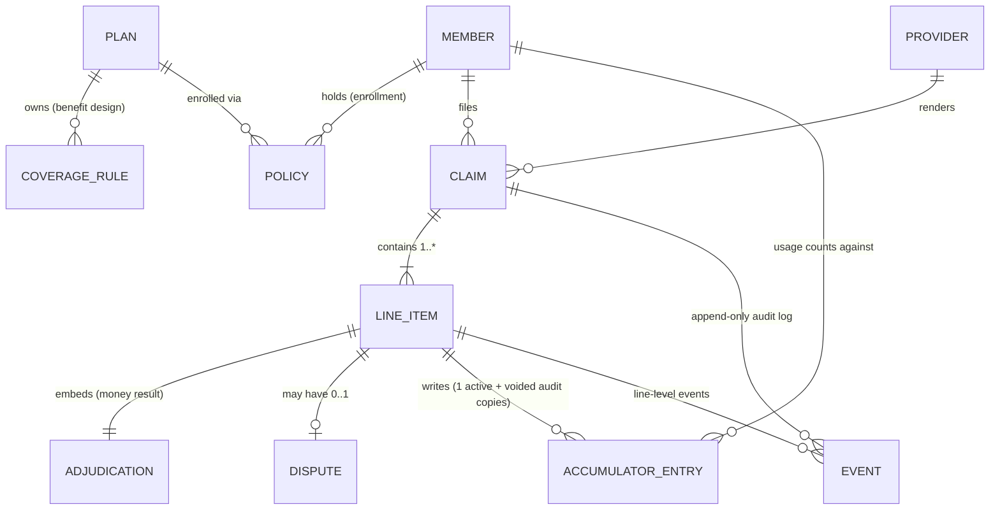
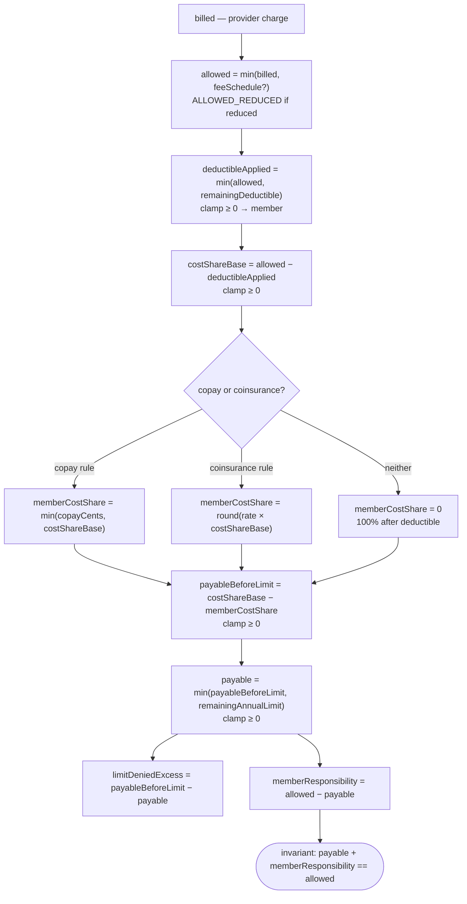
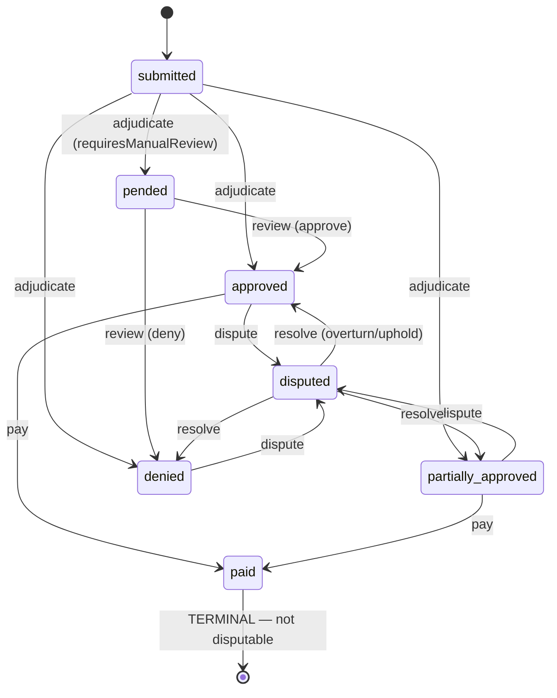
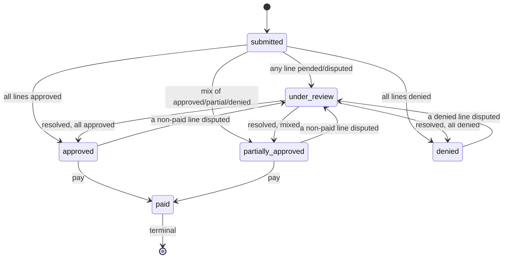
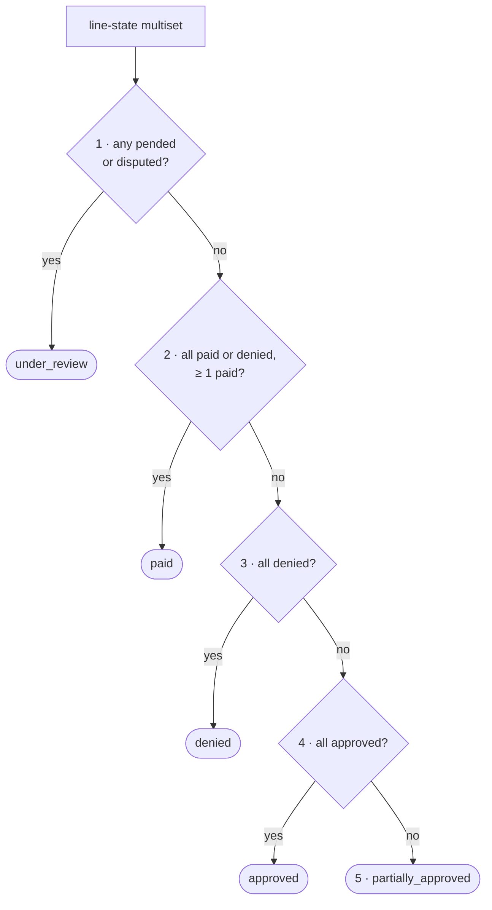
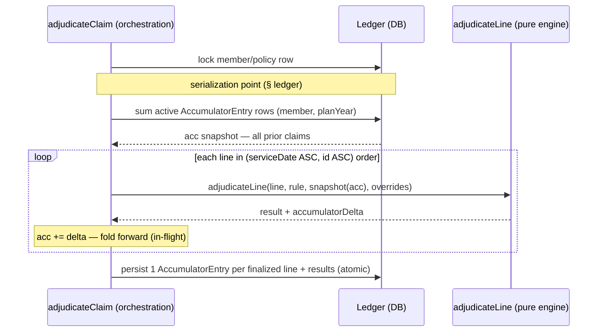
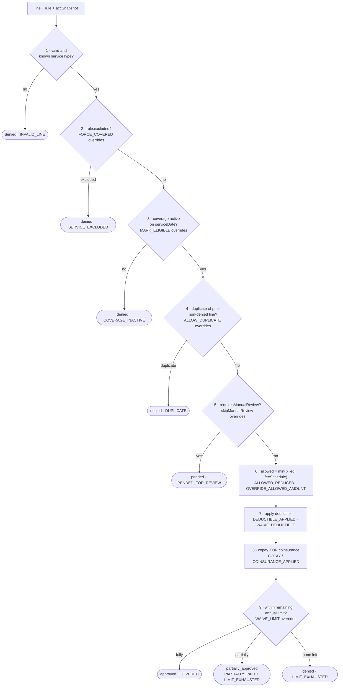

# Domain Model — Claims Processing System

> The entities, relationships, state machines, and the adjudication engine.
> Scope decisions and assumptions are justified in `decisions.md`; domain
> vocabulary is in `domain-research.md`.

## 1. Scope at a glance

Three flows, built well:

1. **Submit a claim** with N line items (plans+rules, policies, members,
   providers are seeded reference data — not managed through the API), then
   **adjudicate** it (a two-step flow: submit → adjudicate).
2. **Adjudicate** each line item through a deterministic pipeline → produce a
   decision, a payable amount, and a structured explanation; roll the claim
   status up from its lines.
3. **Dispute** a resolved line item → reviewer upholds or overturns via a
   unified re-adjudication path.

Plus a **manual-review** path (`pended` lines) that the prompt explicitly calls
out.

**In scope rules:** exclusion, eligibility (coverage active on service date),
duplicate detection, fee-schedule allowed amount, annual deductible, copay
**XOR** coinsurance, annual per-service dollar limit (with partial pay on
overflow), manual-review flag.

**Explicit cuts** (see `decisions.md`): OOP maximum, visit/frequency limits,
waiting periods, pre-authorization, in/out-of-network rate negotiation,
medical-necessity code matching, real ICD/CPT code sets, auth, multi-level
appeals, cascading re-adjudication across claims.

## 2. Entities & relationships



> **Reading the diagram.** A **Plan** owns its `CoverageRule`s and is enrolled in by
> many `Policy` rows; a **Policy** ties one `Member` to one `Plan` over an effective
> window. A `Claim` belongs to a `Member` + `Provider` and holds 1..* `LineItem`s,
> each with an embedded `Adjudication`, an optional `Dispute`, and one *active*
> `AccumulatorEntry` (plus voided audit copies). `Event` is the append-only log,
> keyed to the `Claim` and optionally a `LineItem`.

Two things changed from the first draft, after a domain pass:
- **Plan vs Policy** are split. A **Plan** is the reusable *benefit design* (the
  coverage rules + deductible/limits); a **Policy** is a member's *enrollment* in a
  Plan over an effective window. Coverage rules belong to the Plan, not the member.
- **Accumulators are a ledger**: each finalized line writes an `AccumulatorEntry`;
  "used so far" is the **sum of active (non-voided) entries**, not a mutated total.
  A dispute reversal *voids* an entry rather than doing reverse arithmetic.

### Member
| Field | Notes |
|---|---|
| id | |
| name | **PHI** |
| dateOfBirth | **PHI** |

> One member per policy is assumed — no subscriber/dependent distinction, no
> group/employer sponsor. Both are named cuts (`decisions.md`).

### Plan — *the reusable benefit design*
| Field | Notes |
|---|---|
| id | |
| name | e.g. "Gold PPO 2026" |
| planYear | the accumulator period (calendar year — see "Plan year" note below) |
| deductibleAnnualCents | annual deductible for this design |
| coverageRules | 1..* CoverageRule — **owned by the Plan**, shared across all enrolled members |

### Policy — *a member's enrollment in a Plan*
| Field | Notes |
|---|---|
| id | |
| memberId | FK → Member |
| planId | FK → Plan |
| effectiveFrom / effectiveTo | eligibility window (drives the active-on-serviceDate check) |

> **Plan year is governed by the date of service, not the submission date.** A
> service rendered Dec 2025 but submitted Jan 2026 counts against the **2025**
> deductible and limits. Consequences: (a) eligibility (step 3) and the accumulator
> period both key off `serviceDate` — one consistent clock; (b) a single claim whose
> lines straddle a year boundary simply hits **two different accumulators**, one per
> line, which falls out of per-line adjudication for free. Plan year = calendar year
> for now; non-calendar plan years (e.g. Oct–Sep) are a config extension.
>
> Because `serviceDate` is this single clock, submit-time validation rejects a date
> that isn't a real calendar day — not just a shape check. `2026-02-30` matches
> `YYYY-MM-DD` but `new Date` rolls it forward to Mar 2, which would silently
> mis-bucket eligibility and the accumulator year; the validator requires the parsed
> date to round-trip back to the same string, so the claim is a `422` and no row is written.
> **Timely-filing limits** (rejecting claims filed too long after service) are a named cut.

### CoverageRule — *the centerpiece; data, interpreted by the engine*
*Belongs to a Plan.* One rule per service type per plan.
| Field | Meaning |
|---|---|
| planId | FK → Plan |
| serviceType | benefit category the line is matched on (e.g. `OFFICE_VISIT`, `PT`, `SURGERY`) |
| excluded | if true, the service is never covered |
| allowedAmountCents? | optional fee schedule; `allowed = min(billed, scheduled)`, else `billed` |
| copayCents? | fixed member copay **(at most one of copay/coinsurance)** |
| coinsuranceRate? | member percentage 0..1 **(at most one of copay/coinsurance)** |
| annualLimitCents? | max **insurer-paid** dollars per plan year for this service type |
| requiresManualReview | if true, matching lines are `pended` for a human |

> **Cost-share is "at most one of" copay/coinsurance — not strict XOR.** A rule with
> **neither** is well-defined and common: it means `coinsuranceRate = 0`, i.e. the insurer
> pays **100% of the cost-share base** (full coverage, no member cost-share — e.g.
> preventive care). The deductible still applies first. (First-dollar / deductible-exempt
> coverage would need a future `deductibleExempt` flag — a named cut, not built now.)
> Validation forbids only the *both-set* case.

> **Who owns `serviceType`?** It is a **payer-controlled benefit category**, not a member
> assertion. In reality the provider submits a procedure code (CPT) and the payer maps
> `procedureCode → serviceType` via a crosswalk. We collapse that to a direct `serviceType`
> field on the line as a deliberate simplification, but it is **validated** against the
> plan's known service types — an unknown type fails step 1 (`INVALID_LINE`), never
> trusted blindly. Adding the code crosswalk is a clean stretch (named in `decisions.md`).

### Provider
`id`, `name`. Network rate negotiation is out of scope, so the provider is a
label on the claim, not an adjudication input (one named cut).

### Claim
| Field | Notes |
|---|---|
| id | |
| memberId, providerId | FKs |
| status | **derived** from line items (see §4) |
| submittedAt | |
| paidAmountCents? | set at disbursement (Σ payable of paid lines); null until paid |
| paidAt? | disbursement timestamp; null until paid |
| lineItems | 1..* |

> Payment is modelled as **fields on the claim**, not a separate `Payment` entity.
> Since `paid` is terminal and clawback is a cut, fields suffice; a disbursement
> ledger would only be needed to support post-payment adjustments.

### LineItem
| Field | Notes |
|---|---|
| id | |
| serviceType | matched against a CoverageRule |
| serviceDate | drives eligibility + duplicate detection |
| diagnosisCode | **PHI**; stored, not deeply validated (medical necessity is a cut) |
| billedAmountCents | what the provider charged |
| status | per-line state machine (§4) |
| adjudication | embedded Adjudication result (§5) |

### Adjudication (embedded in LineItem)
The money breakdown + ordered reasons. See §5.

### AccumulatorEntry — *the "track usage against limits" model, as a ledger*
One row **per finalized line item** (not per member). "Used so far" is a **query**,
not a stored total:
| Field | Notes |
|---|---|
| id | |
| lineItemId | the line that produced this entry. **At most one *active* entry per line**; a dispute reversal voids the old one and writes a new one, so over time a line may have several rows (one active + voided audit copies) — *not* a DB unique key |
| memberId | whose usage this counts against |
| planYear | `calendarYear(line.serviceDate)` |
| serviceType | for per-service benefit limits |
| deductibleDeltaCents | this line's contribution to the deductible |
| benefitDeltaCents | insurer-paid cents (counts against the annual limit) |
| voided | true once a dispute reverses this line; voided entries don't count |

Derived reads the engine consumes as its `AccumulatorSnapshot`:
```
deductibleMet(member, year)        = Σ deductibleDeltaCents  WHERE !voided
benefitUsed(member, year, service) = Σ benefitDeltaCents     WHERE !voided
```

Why a ledger over a mutable total:
- **Dispute reversal = void the line's entry** (then re-adjudicate writes a fresh
  one), instead of reverse-then-reapply arithmetic that can drift.
- Every limit-affecting decision is **auditable** — you can see which line consumed
  what, which directly supports the explanation + retroactive-change signals.
- Cost: usage is a `SUM` on read (cheap at this scale; index on
  `(memberId, planYear, serviceType, voided)`), and the intra-claim fold (§5) sums
  the prior lines' *in-flight* deltas on top of the persisted sum.

> **Concurrency invariant — usage updates serialize per member.** Two claims for the
> same member adjudicated concurrently could each read the same ledger sum and both
> approve against the full remaining limit (the cross-request twin of the intra-claim
> fold bug). Rule: a claim is adjudicated inside **one transaction** that serializes on
> the member's usage — e.g. a row lock on the `Policy`/member row taken before summing
> the ledger, so the sum→decide→insert sequence is atomic. Locally, **SQLite's
> single-writer model makes this concrete**; on Postgres it's `SELECT … FOR UPDATE` on
> the member/policy row. Stated as an invariant, not relied on by accident.

### Event — *append-only lifecycle / audit log*
One row per state transition, never updated or deleted:
| Field | Notes |
|---|---|
| id | |
| claimId | FK → Claim |
| lineItemId? | set for line-level events (adjudicated, pended, disputed, resolved) |
| type | `SUBMITTED`, `ADJUDICATED`, `PENDED`, `DISPUTED`, `RESOLVED`, `PAID` |
| fromState / toState | the transition |
| actor | `member`, `system`, or `reviewer` (no auth — a label, see cut below) |
| note | reviewer note / dispute reason |
| overridesApplied? | override directives used on a resolution |
| createdAt | |

> The event log makes the **state machine observable** (a claim's full timeline is
> queryable, not just its latest state), gives disputes/overturns a **retroactive-change
> audit trail**, and is the backbone of a real PHI access/change audit. `actor` is a
> plain label because auth is out of scope — wiring it to a real identity is the
> extension.

### Dispute (0..1 per LineItem)
| Field | Notes |
|---|---|
| lineItemId | the disputed line |
| reason | member's stated reason |
| fromStatus | the line's decided status before the dispute, restored on `uphold` |
| status | `open → resolved` |
| resolution | `uphold` or `overturn` |
| overrides? | `Set<{type, value?}>` applied on overturn (taxonomy in §5) |
| note | reviewer note |

## 3. Money model

All amounts are **integer cents**. Every operation **clamps to ≥ 0** so cost-share
can never exceed the base and payable can never go negative.



The exact arithmetic the diagram summarizes:

```
billed                       what the provider charged
allowed   = min(billed, feeSchedule?)         (ALLOWED_REDUCED if reduced)
deductibleApplied  = min(allowed, remainingDeductible)   ← clamped
costShareBase      = allowed − deductibleApplied          (≥ 0)
memberCostShare    = copay-XOR-coinsurance, clamped to costShareBase:
                       copay rule       → min(copayCents, costShareBase)
                       coinsurance rule → round(coinsuranceRate × costShareBase)
payableBeforeLimit = costShareBase − memberCostShare      (≥ 0)
payable            = min(payableBeforeLimit, remainingAnnualLimit)   (≥ 0)
limitDeniedExcess  = payableBeforeLimit − payable
memberResponsibility = allowed − payable
```

Clamps that matter (each has a behavior spec, §7):
- **copay > allowed** (e.g. $30 copay on a $20 visit) → `memberCostShare` clamped to
  `costShareBase`, `payable = 0`, never negative.
- **deductible ≥ allowed** → `costShareBase = 0`, copay/coinsurance apply to 0, `payable = 0`.

### Money tuple per outcome

The invariant `payable + memberResponsibility == allowed` holds **for every line
that reaches the money steps (6–9)** — i.e. covered services. The two denial
flavors differ, and this distinction is deliberate:

| Outcome | allowed | payable | memberResponsibility | accumulator delta |
|---|---|---|---|---|
| **approved** | computed | > 0 | allowed − payable | deductible + benefitUsed applied |
| **partially_approved** (limit overflow) | computed | 0 < payable < base | allowed − payable | deductible + benefitUsed applied |
| **denied — limit fully exhausted** (step 9, remaining = 0) | computed | 0 | = allowed | **deductible applied**, benefitUsed += 0 |
| **denied — hard** (steps 1–4: excluded / inactive / duplicate / invalid) | **0** | 0 | **0** (member owes the *provider*, not the insurer — outside our money model) | **none** |
| **pended** | null until reviewed | null | null | **none** until resolved |

> Key decision: a **limit-exhausted** line is a *covered* service whose annual cap is
> hit, so the member's deductible-eligible spend is real → its **deductible delta still
> applies**. A **hard-denied** line never touches money or accumulators. This keeps
> "denied because the rules say no" cleanly separate from "denied because the budget is
> spent."

## 4. State machines

### Line item



- **approved** — fully covered (member may still owe deductible/copay; still "approved").
- **partially_approved** — reserved **only** for the annual-limit overflow split.
- **denied** — not covered / invalid / limit fully exhausted.
- **pended** — `requiresManualReview` rule matched; no accumulator effect yet.
- **disputed** — member contested a *resolved-but-not-yet-paid* line; awaiting reviewer.
- **paid** — **terminal**. Disbursed money is final in this scope.

> **Disputable states = `approved`, `partially_approved`, `denied` (pre-payment only).**
> Once a line is `paid` it is terminal and **cannot be disputed**. This is a deliberate
> cut: clawback / supplemental-payment after disbursement needs a money-ledger we don't
> model. In practice disputes target denials and partials — all pre-payment — so the
> common case is covered. (See `decisions.md`.)

### Claim — **derived** from its line items (never set directly)



> Every arrow above is a **re-derivation**, not a stored mutation — `deriveClaimStatus`
> recomputes the claim status from the current line-state multiset after any line
> transition (precedence rules below).

Claim status is a **total pure function** `deriveClaimStatus(lineStates[]) →
ClaimStatus`, evaluated by **first matching precedence rule** (top wins):

| # | Condition over the line-state multiset | Claim status |
|---|---|---|
| 1 | any line `pended` **or** `disputed` (unresolved) | `under_review` |
| 2 | every line `paid` **or** `denied`, with **≥ 1 paid** | `paid` |
| 3 | **all** lines `denied` | `denied` |
| 4 | **all** lines `approved` (none denied/partial) | `approved` |
| 5 | otherwise (any mix of approved / partially_approved / denied) | `partially_approved` |

The same first-match cascade as a decision tree (top rule wins, evaluation stops at
the first `yes`):



Notes that close the reviewer's edge cases:
- **All-pended** falls under rule 1 → `under_review` (correctly "nothing decided yet").
- **`paid` is terminal at the claim level too:** a claim is `paid` once every line is
  `paid` or `denied` with at least one `paid` (rule 2) — a *partially-denied* claim, once
  disbursed, is terminal, **not** `partially_approved`. Because paid lines aren't disputable
  (§4), a paid claim cannot revert — rule 1 can never re-fire on it. This both removes the
  earlier "paid claim with a disputed line" contradiction and prevents a disbursed
  partially-denied claim from looking unfinished (or being re-paid).
- **Paid amount = Σ payable of `paid` lines**, computed once at disbursement and stored —
  not recomputed on read, so no double-counting.

Deriving claim status (rather than storing it independently) makes inconsistent
states unrepresentable.

## 5. Adjudication pipeline

A pure function over **non-PHI inputs only**:

```
adjudicateLine(
  line:        { serviceType, serviceDate, billedAmountCents },  // no name, no diagnosis
  rule:        CoverageRule,
  accSnapshot: { deductibleMet, deductibleAnnual, benefitUsed[serviceType], annualLimit },
  overrides?:  Set<Override>
) → { outcome, allowedCents, payableCents, memberResponsibilityCents,
      reasons[], accumulatorDelta }
```

> **PHI boundary (named scoring signal):** `adjudicateLine` is never passed `member.name`,
> `dateOfBirth`, or `diagnosisCode`. Coverage decisions depend only on service type, dates,
> amounts, and accumulators — so the entire rules engine, its logs, and its `reasons[]`
> are PHI-free by construction. PHI lives on the `Member`/`LineItem` records and the API
> read layer, not in adjudication.

Each step **emits a reason** as a side effect, so the ordered `reasons[]` is a
byproduct of execution (no separately maintained trace).

### Claim-level folding (intra-claim accumulator ordering)

Adjudication is invoked **per claim, as one transaction**, not per isolated line.
Lines are processed in a **deterministic order** — `(serviceDate ASC, lineItem.id ASC)`
— and the accumulator is **folded** through them: line N is adjudicated against a
snapshot that already includes the deltas of lines 1..N-1 *within the same claim*.

```
adjudicateClaim(claim):
  lock member/policy row                                   // serialization point (§ ledger)
  acc = sum active AccumulatorEntry rows for (member, planYear)  // all prior claims
  for line in sortBy(claim.lines, serviceDate, id):        // deterministic
      result = adjudicateLine(line, rule(line), snapshot(acc), overrides)
      acc   += result.accumulatorDelta                     // fold forward (in-flight)
  persist: one AccumulatorEntry per finalized line + line results, atomically
```

The same flow as a transaction timeline — note the **fold** inside the loop and the
single atomic write at the end:



The in-memory `acc` fold is unchanged by the ledger model — the engine still reads a
snapshot of totals and emits a delta. The only difference is at the boundary: the
snapshot is **summed from the ledger** at the start, and each line's delta is
**written as a new `AccumulatorEntry`** at the end, rather than mutating a stored total.

The same fold also enforces **intra-claim duplicates**: a line whose
`(serviceType, serviceDate)` matches an earlier *non-denied* line in the same claim is
marked duplicate (gate 4) — so a non-limited service (e.g. a flat copay with no annual
limit) billed twice on one claim is denied `DUPLICATE` on the second line, not paid
twice. Provider is claim-level, so it isn't part of the intra-claim key; cross-claim
duplicate detection (which keys on provider) stays in the orchestration layer.

Why this matters (the reviewer's blocker case): a claim with **two `PT` lines** each
wanting $1500 against a `remainingLimit` of $2000. Folding means line 1 consumes
$1500, line 2 sees `remaining = 500` → pays $500, denies $1000. Total paid $2000,
never exceeding the cap. The same fold protects the shared deductible. Without
folding both lines would read $2000/full-deductible and overspend. **Spec'd in §7.**

Order (short-circuits on a terminal denial):



Gates **1–4 are hard denials** that short-circuit (no money, no accumulator effect),
gate **5 pends** for a human, and gates **6–9 compute money**. The dotted-italic notes
mark which **override** lets a reviewer bypass that gate (§ override taxonomy).

| # | Step | Outcome on failure | Reason code |
|---|---|---|---|
| 1 | **validate** (well-formed, known serviceType) | denied | `INVALID_LINE` |
| 2 | **exclusion** (`rule.excluded`) | denied | `SERVICE_EXCLUDED` |
| 3 | **eligibility** (coverage active on serviceDate) | denied | `COVERAGE_INACTIVE` |
| 4 | **duplicate** (matches prior non-denied line) | denied | `DUPLICATE` |
| 5 | **manual review** (`rule.requiresManualReview`, unless overridden) | **pended** | `PENDED_FOR_REVIEW` |
| 6 | **allowed amount** (fee schedule) | — | `ALLOWED_REDUCED` (if reduced) |
| 7 | **deductible** (apply remaining) | — | `DEDUCTIBLE_APPLIED` |
| 8 | **cost share** (copay XOR coinsurance) | — | `COPAY_APPLIED` / `COINSURANCE_APPLIED` |
| 9 | **annual limit** (pay up to remaining) | partially_approved / denied | `PARTIALLY_PAID` + `LIMIT_EXHAUSTED` |
| — | otherwise | approved | `COVERED` |

### Override taxonomy — one exception per overridable gate

An appeal/override is, by definition, *"grant an exception to gate X"* — so the
override set is **one entry per overridable gate**, modelled as `{ type, value? }`
(most are boolean waivers; the fee-schedule one is parameterized):

| Gate (step) | Override `type` | Shape | Effect |
|---|---|---|---|
| exclusion (2) | `FORCE_COVERED` | boolean | treat an excluded service as covered |
| eligibility (3) | `MARK_ELIGIBLE` | boolean | force the eligibility check to pass |
| duplicate (4) | `ALLOW_DUPLICATE` | boolean | bypass duplicate denial |
| deductible (7) | `WAIVE_DEDUCTIBLE` | boolean | skip deductible application |
| fee schedule (6) | `OVERRIDE_ALLOWED_AMOUNT` | **value** (cents) | set `allowed` to a reviewer-specified amount |
| annual limit (9) | `WAIVE_LIMIT` | boolean | pay beyond the remaining annual cap |

Overrides are a **`Set`** (already in the signature): each targets a *distinct* gate
and is applied in pipeline order, so they **compose without conflict** — e.g.
`{WAIVE_DEDUCTIBLE, WAIVE_LIMIT}` skips both gates in one resolution. Constraint: at
most one parameterized override of a given type (two different `OVERRIDE_ALLOWED_AMOUNT`
values are ambiguous → rejected). Every override carries the reviewer's `note` for audit.

**Scope:** the full taxonomy is *defined* here (the principle is what matters);
we **implement `WAIVE_LIMIT`, `MARK_ELIGIBLE`, `WAIVE_DEDUCTIBLE`** as representative
of both shapes, and document the rest as the identical pattern (`decisions.md`).

### Worked example (the partial-approval showcase)

PT line, billed $600; rule: 20% coinsurance, annual limit $2000; member: $1000
deductible with $900 met, PT `benefitUsed` $1800.

```
allowed            = 500   (no fee schedule → billed)
deductibleApplied  = 100   (remaining deductible) → member
costShareBase      = 400
coinsuranceMember  = 80    (20% of 400)           → member
payableBeforeLimit = 320
remainingLimit     = 200   (2000 − 1800)
payable            = 200   → deny excess 120
memberResponsibility = 300 (100 + 80 + 120)
status             = partially_approved
reasons = [DEDUCTIBLE_APPLIED 100, COINSURANCE_APPLIED 80,
           PARTIALLY_PAID 200, LIMIT_EXHAUSTED 120]
accumulatorDelta = { deductibleMet +100, benefitUsed[PT] +200 }
```

## 6. Disputes & manual review — one resolution path

Both pended-line review and dispute overturn run through **one** reconciliation
routine:

```
resolve(lineItem, action, override?):
  lock member/policy row                       // same serialization point as submit
  void  lineItem's prior AccumulatorEntry      (if it had one)
  if action == deny:        outcome = denied, payable = 0   (no new entry)
  else:                     re-run adjudicateLine(line, rule, snapshot(acc), override)
                            write a fresh AccumulatorEntry for the new delta
  re-derive parent claim status; append a RESOLVED event
```

The single reconciliation path as a timeline — the **void → re-run → write fresh**
sequence that replaces reverse-then-reapply arithmetic:

```mermaid
sequenceDiagram
    participant R as resolve (review / dispute)
    participant DB as Ledger (DB)
    participant E as adjudicateLine (pure engine)

    R->>DB: lock member/policy row
    Note over R,DB: same serialization point as submit
    R->>DB: void line's prior AccumulatorEntry (if any)
    Note over DB: voided entry kept as audit record
    alt action == deny (or uphold a denial)
        Note over R: outcome = denied, payable = 0 — no new entry
    else approve / overturn
        R->>E: re-run adjudicateLine(line, rule, snapshot(acc), overrides)
        E-->>R: new result + delta
        R->>DB: write a fresh AccumulatorEntry for the new delta
    end
    R->>DB: re-derive parent claim status; append RESOLVED event
```

With the ledger, "reverse then reapply" becomes **void the old entry, write a new
one** — no in-place arithmetic, and the voided entry stays as an audit record of what
the decision *used to* consume.

- **Pended line review** — `approve` runs the engine and applies the delta;
  `deny` finalizes the line `denied` with a `REVIEW_DENIED` reason and no ledger effect.
- **Dispute overturn** — reviewer supplies one or more `override` directives from the
  taxonomy in §5 (e.g. `WAIVE_LIMIT`, `WAIVE_DEDUCTIBLE`, or a parameterized
  `OVERRIDE_ALLOWED_AMOUNT`); the engine recomputes the money with those exceptions
  applied in pipeline order. **Uphold** is the trivial case: close the dispute, no
  re-run, no delta change.

### What this guarantees — and what it does NOT (calibrated trade-off)

**Guarantees:** the resolved line's own contribution is internally consistent — voiding
the old `AccumulatorEntry` fully removes it before a new one is written, so the line
never double-counts against itself, and member usage stays exactly the sum of active
entries.

**Does NOT guarantee** consistency with *other* claims adjudicated in between. The
re-run recomputes against the ledger's **current** sum, which has since moved.
Concretely:

> Claim A (PT, consumes the last $500 of a $2000 limit) → A's line denied/partial.
> Member disputes A; meanwhile Claim B already consumed $500 of freed headroom... no —
> more precisely: A is denied for exhaustion; B (later) is also denied. We overturn A
> with `WAIVE_LIMIT`. A now pays, pushing `benefitUsed` *above* the annual cap, and B
> stays denied even though, re-run from scratch in time order, B might have been the one
> to get the remaining dollars. The numbers are self-consistent but **order-dependent**.

We **accept** this: a dispute resolves *one* line against present state; we do **not**
cascade-re-adjudicate other claims, and an override may intentionally exceed a cap (it's
an exception, by definition). This is the documented limit of the consistency model, not
an accidental bug — `decisions.md` records it, and §7 has a spec demonstrating the
order-dependence so it's visible, not hidden.

## 7. Behavior specs (written first — TDD)

These encode domain rules, not HTTP status codes. Each is a failing test before the
code that satisfies it (visible in git history). Titles are the spec:

**Cost-sharing & clamping**
- applies copay then pays the remainder when allowed exceeds the copay
- applies coinsurance percentage after the deductible
- **a rule with neither copay nor coinsurance pays 100% of the cost-share base** (preventive-style)
- **clamps cost-share when copay exceeds the allowed amount → payable is 0, never negative**
- **when the deductible fully absorbs the allowed amount, payable is 0 and copay does not go negative**
- reduces allowed to the fee-schedule rate and reports `ALLOWED_REDUCED`
- rejects a rule that sets **both** copay and coinsurance (validation)

**Accumulators**
- **depletes the annual deductible across two separate claims** (claim 1 partially meets it, claim 2 sees the remainder)
- **two same-serviceType lines in ONE claim collectively cannot exceed the remaining annual limit** (intra-claim fold)
- pays a line up to the exact remaining limit and denies the excess as `partially_approved`
- denies a line entirely as `LIMIT_EXHAUSTED` when remaining limit is 0, **but still applies its deductible delta**
- a hard-denied line (excluded/duplicate) writes **no** accumulator delta
- **a line's accumulator period is its `serviceDate` year** — a Dec-service / Jan-submission line hits the prior year
- **a claim with lines straddling a year boundary updates two separate accumulators**
- **concurrent claims for the same member do not overspend a limit** (accumulator serialization invariant)

**State & rollup**
- `deriveClaimStatus`: all-approved → approved; all-denied → denied; mix → partially_approved; any-pended → under_review; all-paid → paid
- a `requiresManualReview` service type pends the line and forces the claim to `under_review`
- a paid line cannot be disputed (terminal)

**Disputes / review**
- overturning a denied line with `WAIVE_LIMIT` voids no entry (it had none), runs the engine, and pays it
- **overturning with `WAIVE_DEDUCTIBLE` skips the deductible step and pays more**
- **combines two overrides in one resolution** (`{WAIVE_DEDUCTIBLE, WAIVE_LIMIT}`) and applies both
- **rejects two conflicting `OVERRIDE_ALLOWED_AMOUNT` values**
- resolving a pended line via `approve` writes an accumulator entry; `deny` writes none
- **voiding then re-writing an entry leaves member usage = Σ active entries** (no drift)
- **demonstrates order-dependence:** overturning an exhausted line with an override can push `benefitUsed` past the cap (documented limitation, §6)

**Ledger & events**
- **`benefitUsed` equals the sum of active (non-voided) `AccumulatorEntry` rows**
- a disputed-and-overturned line's old entry is `voided` (kept for audit), a new one written
- every transition (`SUBMITTED`, `ADJUDICATED`, `DISPUTED`, `RESOLVED`, `PAID`) appends an `Event`

**Explanation**
- a partially approved line lists both the paid portion and the `LIMIT_EXHAUSTED` excess with amounts
- `payable + memberResponsibility == allowed` for every covered (money-reaching) line

## 8. Why this decomposition

- **Plan vs Policy** — the benefit *design* (Plan + its coverage rules) is separated
  from a member's *enrollment* (Policy). Rules are shared, not copied per member, and
  "is this member covered" (Policy effective window) is distinct from "what does the
  plan pay" (Plan rules).
- **Coverage rules are data, not code.** The engine *interprets* `CoverageRule`
  rows, so a new benefit is a row, not a deploy. Plan data and adjudication
  logic stay separate.
- **Adjudication is per line item**, claim status is **derived** — this is what
  makes partial approvals fall out naturally instead of being special-cased.
- **Usage is a ledger, not a mutable counter** — `benefitUsed`/`deductibleMet` are the
  *sum of active `AccumulatorEntry` rows*. This makes every limit decision auditable and
  turns dispute reversal into "void an entry," not fragile reverse-then-reapply math.
- **One engine, one resolution path** — submission, manual review, and disputes
  all flow through the same function, so the money math and ledger bookkeeping have a
  single source of truth.
- **Reasons are emitted by execution** — the explanation is a byproduct of
  adjudicating, so "why" can never disagree with "what."
- **The event log makes lifecycle observable** — state is derivable at any point in
  time, not just "now," which is what real claims operations and PHI audits require.
